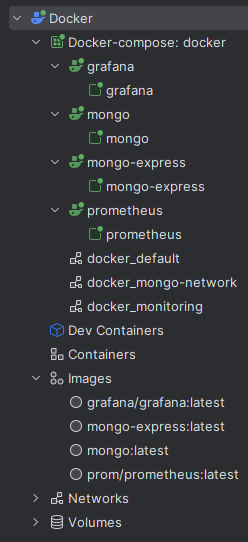
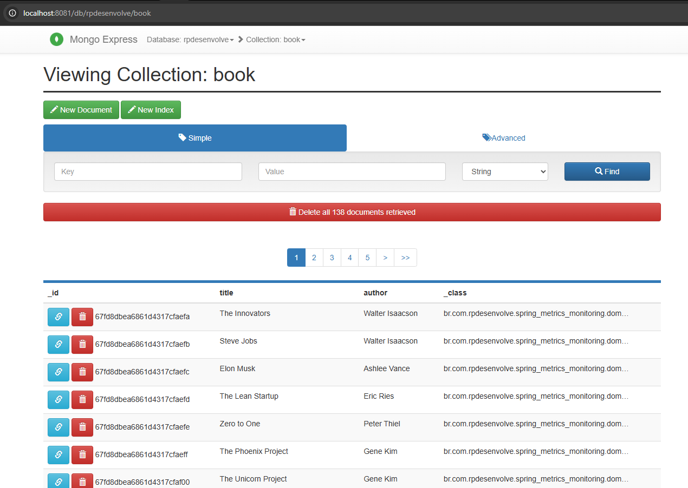
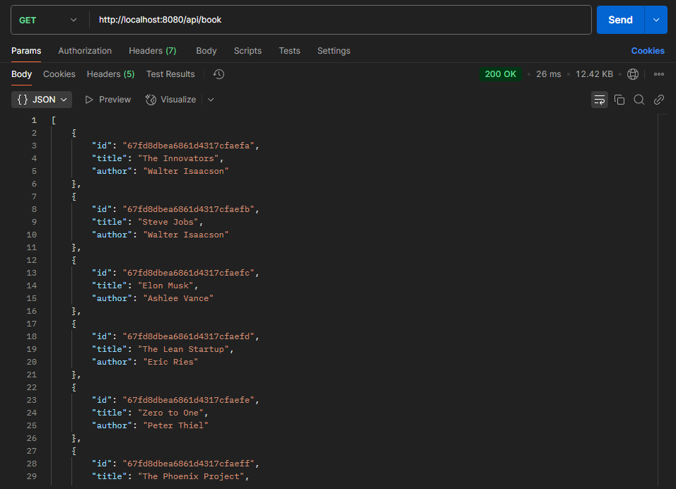
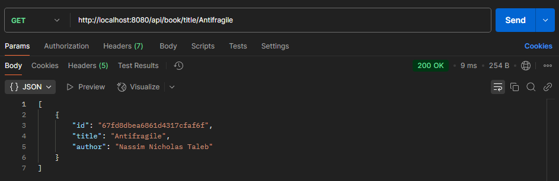
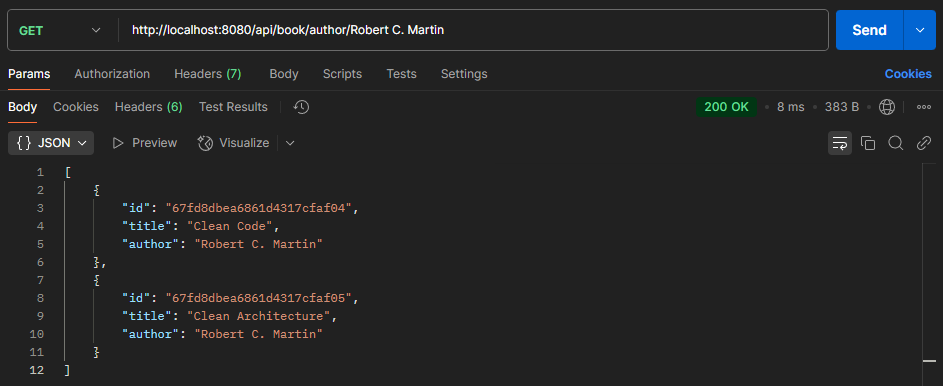
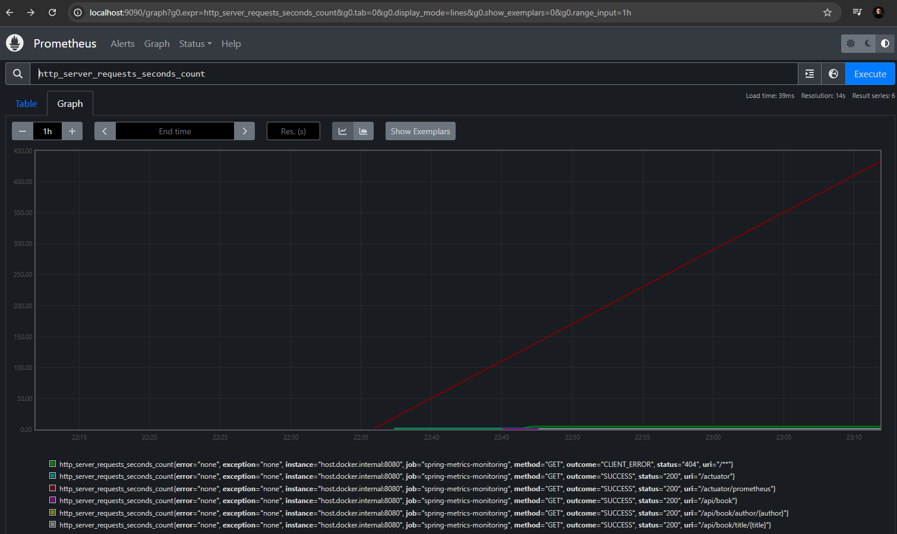
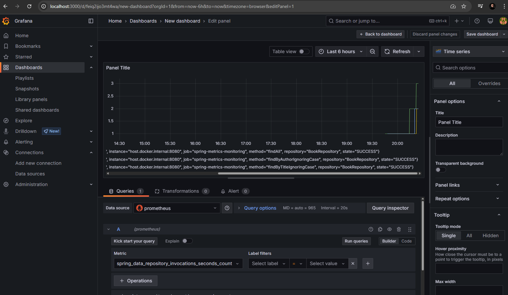

## Metrics Pattern with Spring, Prometheus and Grafana

## Technologies
- Java
- Spring Boot
- Spring Actuator
- MongoDB
- Mongo Express
- Prometheus
- Grafana
- Docker
- Hexagonal Architecture

## Metrics Stack (Prometheus + Grafana)
- Mongo
  - Image: latest
  - Ports: 27017
- Mongo Express
  - Image: latest
  - Ports: 8081
- Prometheus
  - Image: latest
  - Ports: 9090
- Grafana
  -  Image: latest
  - Ports: 3000

## Usage
1. Clone the repository
2. Start the Metrics Stack using Docker
   ```bash
   docker-compose up -d
   ```
3. Access Mongo Express at `http://localhost:8081/`
   - Create a database named `rpdesenvolve`
4. Build Java the application
5. Access Prometheus at `http://localhost:9090/`
6. Access Grafana at `http://localhost:3000/`
7. Login to Grafana
   - Username: admin
   - Password: pass
8. Access Spring actuator at `http://localhost:8080/actuator`
9. Access the application at `http://localhost:8080`
10. Send a request to the application
   ```bash
   curl -X GET http://localhost:8080/api/book
   curl -X GET http://localhost:8080/api/book/title/Antifragile
   curl -X GET http://localhost:8080/api/book/author/Robert%20C.%20Martin
   ```
## Docker Images and Containers


## MongoDB Data Bulk


## Rest APIs


---



---



## Prometheus Dashboard


## Grafana Dashboard
